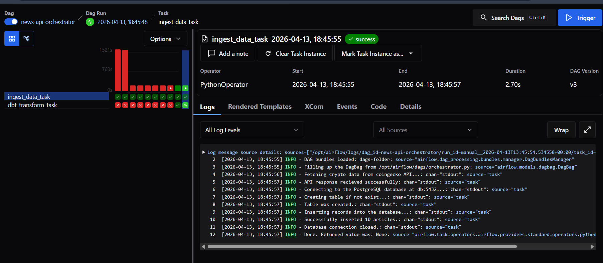
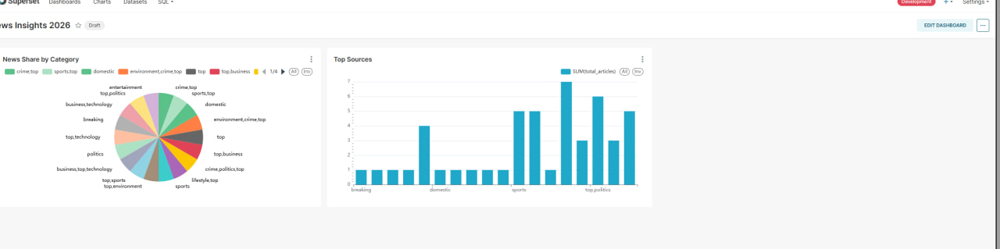

# 📰 End-to-End News Data Pipeline

## 🚀 Project Overview
This project is an automated, end-to-end data engineering pipeline designed to extract, transform, and visualize real-time global news data. It demonstrates a modern data stack architecture, from API integration to a dynamic business intelligence dashboard.

**Key Goal:** To build a robust pipeline that consistently gathers news articles, normalizes the data, and provides actionable insights (like top news sources and category breakdowns) without manual intervention.

---

## 🛠️ Tech Stack & Architecture
* **Orchestration:** Apache Airflow
* **Data Ingestion:** Python (Custom Scripts via News API)
* **Data Transformation:** dbt (Data Build Tool)
* **Data Storage:** PostgreSQL
* **Data Visualization:** Apache Superset
* **Containerization:** Docker & Docker Compose

---

## 🔄 Pipeline Workflow

1. **Extract (API Integration):** A Python script runs via an Airflow PythonOperator, fetching the latest news articles from an external News API.
2. **Load (Staging):** The raw JSON data is processed and inserted into a PostgreSQL staging table (`staging`).
3. **Transform (dbt):** Airflow triggers a DockerOperator that spins up a dbt container. dbt models connect to PostgreSQL, clean the data (e.g., parsing arrays, removing special characters), and aggregate metrics into final reporting tables (`news_report` and `news_summary`).
4. **Visualize (Superset):** Apache Superset connects to the PostgreSQL reporting tables, displaying live metrics such as:
   * Total number of ingested articles (Big Number KPI)
   * News distribution by category (Pie Chart)
   * Activity level by news source (Bar Chart)

---

## 📊 Dashboard Preview


* **News by Category:** Visualizing the diversity of topics.
* **Top Sources:** Tracking which publishers are most active.

---

## ⚙️ How to Run the Project Locally

### Prerequisites
* Docker and Docker Compose installed
* A valid News API Key


### Steps
1. **Clone the repository:**
   ```bash
   git clone [https://github.com/YOUR_USERNAME/news-data-pipeline.git](https://github.com/YOUR_USERNAME/news-data-pipeline.git)
   cd news-data-pipeline
